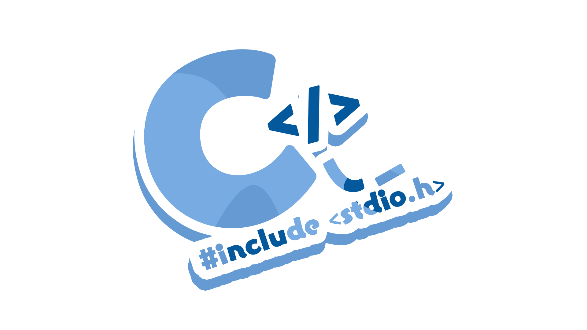
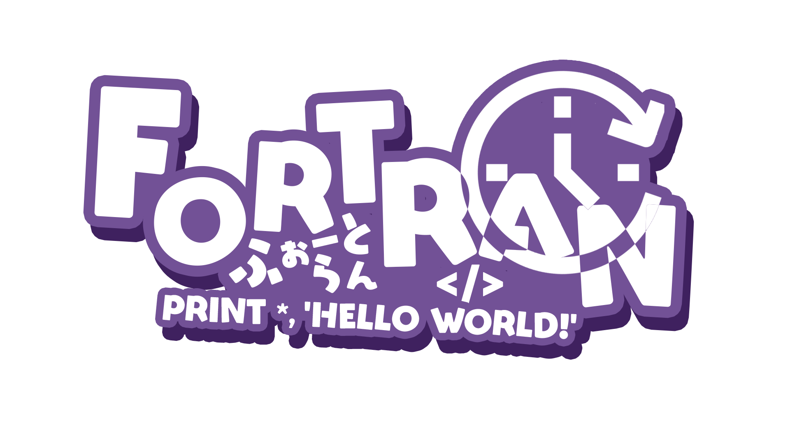
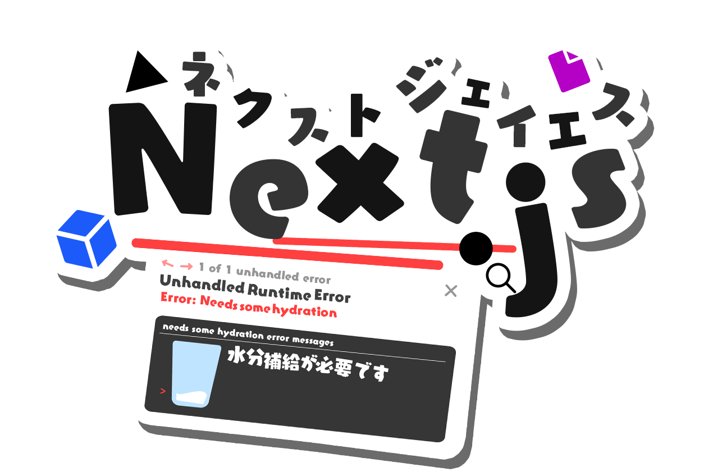
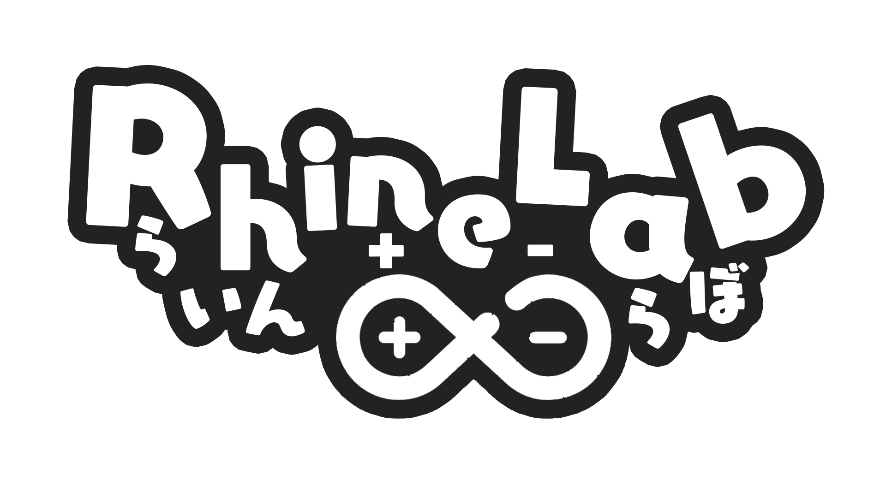
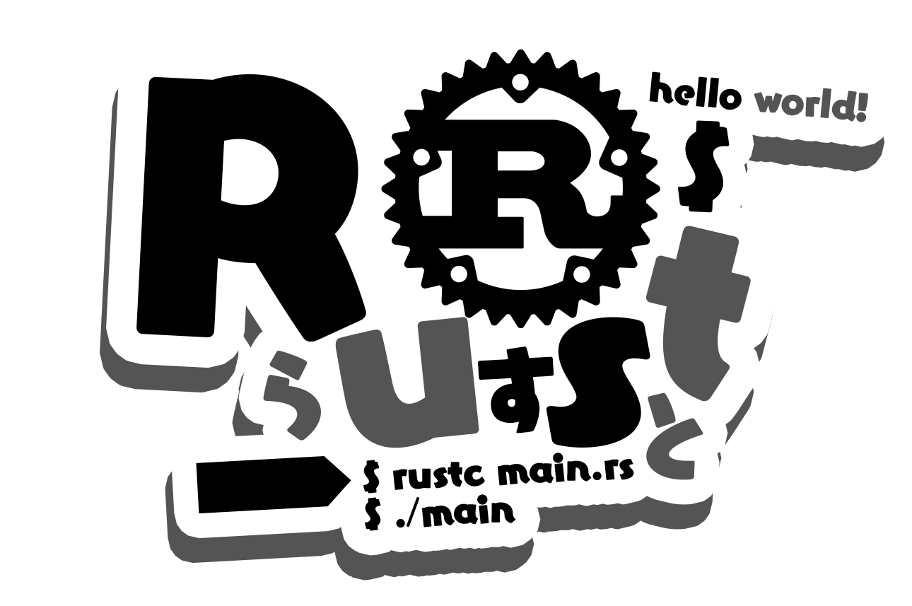

<!-- markdownlint-disable MD026 MD033 MD041 -->

[English README](README.md) | [日本語 README](README-ja.md) | [简体中文 README](README-zhHans.md) | [繁體中文 README](README-zhHant.md) | [Español README](README-es.md) | [README Français](README-fr.md)

# ServiceLogos

Hola, buenas a todos.
Este es un repositorio creado por Sawaratsuki para subir logos de diversos servicios.

> [!WARNING]
> Estos logos no son oficiales.

> [!IMPORTANT]  
> No se permite bajo ningún concepto el uso de el contenido de este repositorio para el entrenamiento de IA.

# Licencia

## Si quieres usar un logo, por favor lee la siguiente sección atentamente

> [!NOTE]
>
> ### Resumen:
>
> - Eres libre de usar este logo para fines no comerciales y sin ánimo de lucro.
>   Por ejemplo, puedes usarlo para imprimirlo como pegatinas, como iconos para editores, etc.
> - ¡Por favor, no olvides atribuir los créditos apropiados!
>   Eres libre de modificar el logo, pero debes licenciar la obra derivada bajo la misma licencia que la del logo original.
> - Si creas algo usando este logo, ¡sería muy motivador que mencionaras a [Sawaratsuki](https://x.com/sawaratsuki1004) al publicarlo!

### Términos

Los logotipos posteriores al `commit[c2cf292]` no están sujetos a la licencia CC BY-NC-SA 4.0.
Las siguientes condiciones se aplican a los logotipos posteriores al `commit[c2cf292]`.

1. El creador de estos logos es Sawaratsuki. No se ha renunciado a los derechos de autor en su totalidad.
2. Por favor, revisa los puntos siguientes:
   > - Se recomienda atribuir el crédito apropiado. Es un gran motivador, así que se ruega hacerlo encarecidamente.
   > - Puedes modificar los logos.
   > - El uso comercial (como la venta de productos que lleven el logo) está prohibido. Sin embargo, se permite su venta si se cumplen las siguientes condiciones:
   >   1. Si el representante oficial de cada servicio quiere usarlo con ánimo de lucro
   >   2. Si se obtiene permiso de Sawaratsuki
   >      (¡Si descubres algún incumplimiento, por favor contacta con [@Sawaratsuki](https://x.com/sawaratsuki1004) inmediatamente!)
3. ¡Se pueden crear pegatinas, parches, etc., para uso personal sin permiso explícito!

# ¿Quieres un logo que no está aquí?

Por favor, añádelo a "Issues". Lo diseñaremos una vez confirmado.
Dependiendo de nuestros horarios individuales, puede que no podamos responder inmediatamente. Podría llevarnos varios días.

> [!IMPORTANT]  
> Cuando añadas una "Issue", asegúrate de incluir la etiqueta de "request".

# Para los representantes oficiales de cada servicio

Por favor envía un [mensaje directo a SAWATSUKI](https://x.com/sawaratsuki1004) para solicitar la eliminación de un logo.
Lo eliminaremos de inmediato.
Si están interesados en comercializar su logo de forma oficial, por favor envíen un [mensaje directo a SAWATSUKI](https://x.com/sawaratsuki1004) de igual manera!

# Herramientas usadas para el diseño

- Photoshop / Illustrator
- Fuente [Eureka Font]
- La motivación y sentimientos de Sawaratsuki
- El feedback y comentarios de todo el mundo

# Aclaraciones y agradecimientos

Estos logotipos son obras derivadas.  
No son mejores que los logotipos utilizados por los respectivos servicios oficiales.  
Queremos expresar nuestro más profundo agradecimiento a los contributores que han publicado aquí sus logos.

## Lista de imágenes

<!-- image-list: start -->

| Nombre                                                                                   | Imagen                                                                                                                                                                                                                                                                                                                                                    |
| ---------------------------------------------------------------------------------------- | --------------------------------------------------------------------------------------------------------------------------------------------------------------------------------------------------------------------------------------------------------------------------------------------------------------------------------------------------------- |
| [403Forbidden](/403Forbidden)                                                            |                                                                                                                                                                                                                                                                                    |
| [404Notfound](/404Notfound)                                                              |                                                                                                                                                                                                                                                                                       |
| [418I'mateapot](/418I%27mateapot)                                                        |                                                                                                                                                                                                                                                                     |
| [503ServiceUnavailable\.png](/503ServiceUnavailable.png)                                 |                                                                                                                                                                                                                                                     |
| [Angular](/Angular)                                                                      |                                                                                                                                                                                                                       |
| [ArchLinux](/ArchLinux)                                                                  |                                                                                                                                                                                                                                                                                       |
| [Bluesky](/Bluesky)                                                                      |                                                                                                                                                                                                                                                                                             |
| [C](/C)                                                                                  |                                                                                                                                                                                                                                                                                                               |
| [C\#](/C%23)                                                                             |                                                                                                                                                                                                                               |
| [C\+\+](/C%2B%2B)                                                                        |                                                                                                                                                                                                                                                                                             |
| [C,C\#,C\+\+](/C%2CC%23%2CC%2B%2B)                                                       |                                                                                                                                                                                                                                                                                          |
| [Clion](/Clion)                                                                          |                                                                                                                                                                                                                                                                                                   |
| [Cloudflare](/Cloudflare)                                                                |                                                                                                                                                                                                                                                                                    |
| [Cobol](/Cobol)                                                                          |                                                                                                                                                                                                                                                                                                   |
| [Crowdstrike](/Crowdstrike)                                                              |                                                                                                                                                                                                                                                                                 |
| [CSS完全に理解した](/CSS%E5%AE%8C%E5%85%A8%E3%81%AB%E7%90%86%E8%A7%A3%E3%81%97%E3%81%9F) |                                                                                                            |
| [Discord](/Discord)                                                                      |                                                                                                                                                                                                                                                                                             |
| [Figma](/Figma)                                                                          |                                                                                                                                                                                                                                                                                                   |
| [FlipperZero](/FlipperZero)                                                              |                                                                                                                                                                                                                                                                                 |
| [Flutter](/Flutter)                                                                      |                                                                                                                                                                                                                                                                       |
| [FORTRAN](/FORTRAN)                                                                      |                                                                                                                                                                                                                                                                                             |
| [GitHub](/GitHub)                                                                        |                                                                                                                                                                                                                                                                                                |
| [GitLab](/GitLab)                                                                        |                                                                                                                                                                                                                                                                                                |
| [Gnuemacs](/Gnuemacs)                                                                    |                                                                                                                                                                                                                                                                                          |
| [Go](/Go)                                                                                |                                                                                                                                                                                                                                                                                                    |
| [HackClub](/HackClub)                                                                    |                                                                                                                                                                                                                                                                                          |
| [Haskell](/Haskell)                                                                      |                                                                                                                                                                                                                   |
| [Hono](/Hono)                                                                            |                                                                                                                                                                                                                                                                                                      |
| [Html](/Html)                                                                            |                                                                                                                                                                                                                                                                                                      |
| [Htmx](/Htmx)                                                                            |                                                                                                                                                                                                                                                                                                      |
| [IamSeries](/IamSeries)                                                                  |     |
| [Java](/Java)                                                                            |                                                                                                                                                                                                                                                                                                      |
| [Julia](/Julia)                                                                          |                                                                                                                                                                                                                                                                                                   |
| [Juniper](/Juniper)                                                                      |                                                                                                                                                                                                                                                                                             |
| [Kernel Panic](/Kernel%20Panic)                                                          |                                                                                                                                                                                                                                                                              |
| [Kotlin](/Kotlin)                                                                        |                                                                                                                                                                                                                             |
| [Laravel](/Laravel)                                                                      |                                                                                                                                                                                                                                                                                             |
| [Lisp](/Lisp)                                                                            |                                                                                                                                                                                                                                                                                                      |
| [MS\-DOS](/MS-DOS)                                                                       |                                                                                                                                                                                                                                                                                                |
| [Mui](/Mui)                                                                              |                                                                                                                                                                                                                                                                                                         |
| [Next\.js](/Next.js)                                                                     |                                                                                                                                                                                                                                                                                             |
| [Node\.js](/Node.js)                                                                     |                                                                                                                                                                                                                                                                                             |
| [NullPointerException](/NullPointerException)                                            |                                                                                                                                                                                                                                                      |
| [Photoshop](/Photoshop)                                                                  |                                                                                                                                                                                                                                                                                       |
| [Python](/Python)                                                                        |                                                                                                                                                                                                                                                                                                |
| [Qwik\.js](/Qwik.js)                                                                     |                                                                                                                                                                                                                                                                                                   |
| [RaspberryPi](/RaspberryPi)                                                              |                                                                                                                                                                                                                                                                           |
| [React](/React)                                                                          |                                                                                                                                                                                                                                                                                                   |
| [RhineLab](/RhineLab)                                                                    |                                                                                                                                                                                                                                                                                          |
| [Rider](/Rider)                                                                          |                                                                                                                                                                                                                                                                                                   |
| [Rstudio](/Rstudio)                                                                      |                                                                                                                                                                                                                                                                                             |
| [Ruby](/Ruby)                                                                            |                                                                                                                                                                                                                                                                                                      |
| [Rust](/Rust)                                                                            |                                                                                                                                                                                                                                                                                                      |
| [Streamloots](/Streamloots)                                                              |                                                                                                                                                                                                                                                                                 |
| [Swift](/Swift)                                                                          |                                                                                                                                                                                                                                                                                                   |
| [Tailwindcss](/Tailwindcss)                                                              |                                                                                                                                                                                                                                                                               |
| [Teamspeak](/Teamspeak)                                                                  |                                                                                                                                                                                                                                                                                       |
| [Twitter](/Twitter)                                                                      |                                                                                                                                                                                                                                                                                             |
| [TypeScript](/TypeScript)                                                                |                                                                                                                                                                                                                                                                                    |
| [Ubuntu](/Ubuntu)                                                                        |                                                                                                                                                                                                                                                                                                |
| [UnityBlender](/UnityBlender)                                                            |                                                                                                                                                                                                                                                                            |
| [VercelAISDK](/VercelAISDK)                                                              |                                                                                                                                                                                                                                                                                             |
| [Vim](/Vim)                                                                              |                                                                                                                                                                                                                                                                                                         |
| [VisualStudio](/VisualStudio)                                                            |                                                                                                                                                                                       |
| [VisualStudioCode](/VisualStudioCode)                                                    |                                                                                                                                                               |
| [Vite](/Vite)                                                                            |                                                                                                                                                                                                                                                                                                      |
| [Voicemod](/Voicemod)                                                                    |                                                                                                                                                                                                                                                                                          |
| [Vrchat](/Vrchat)                                                                        |                                                                                                                                                                                                                                                                                                |
| [Vue](/Vue)                                                                              |                                                                                                                                                                                                                                                                                                         |
| [Wallhack](/Wallhack)                                                                    |                                                                                                                                                                                                                                                                                          |
| [X](/X)                                                                                  |                                                                                                                                                                                                                                                                                                               |

<!-- image-list: end -->

En caso de encontrar incoherencias en los README de los distintos idiomas, se debe tomar el README en japonés como referencia.
