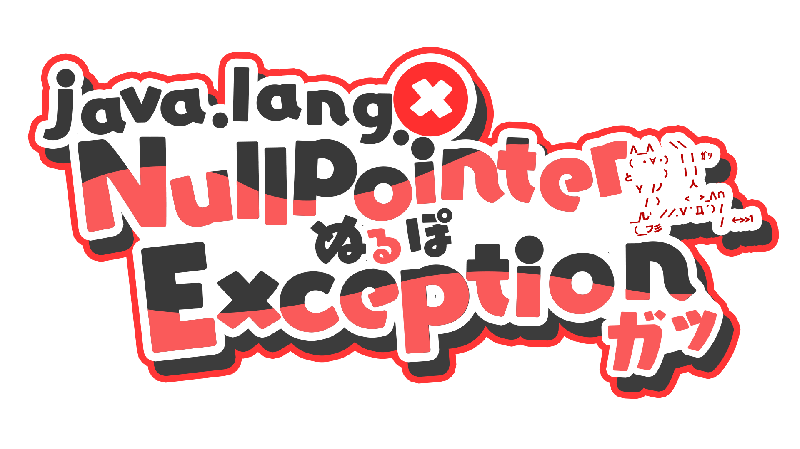

<!-- markdownlint-disable MD026 MD033 MD041 -->

[English README](README.md) | [日本語 README](README-ja.md) | [简体中文 README](README-zhHans.md) | [繁體中文 README](README-zhHant.md) | [Español README](README-es.md) | [README Français](README-fr.md) | [Indonesian README](README-id.md)

# ServiceLogos

早安，又或是晚安

這裡是用來上傳由 Sawaratsuki 所製作的各式 logo 的 Repository。

> [!WARNING]
> 這裡的所有 logo 皆非官方 logo。

> [!Important]
> 禁止這裡全部 logo 用於人工智慧的訓練。

# 許可協議

## 若想使用 logo 的話，請務必認真閱讀本節

> [!NOTE]
>
> ### 概述:
>
> - 若為非營利目的，可以自由地使用這裡的 logo。例如：製作成貼紙自用、IDE icon 等。
> - 可以基於原本的 logo 作適當的修改，但需與原本的許可協議保持一致，也請註明出處。
> - 若有使用到這裡的 logo 製作出一些作品的話，能夠發推特提及 [@Sawaratsuki](https://x.com/sawaratsuki1004)，我會非常高興的！

### 細項

**Commit[c2cf292] 之後的標誌未獲得 CC BY-NC-SA 4.0 授權。**  
**以下條款適用於提交後的標誌 Commit[c2cf292]。**

1. 這些標誌的創作者是澤原月。 這並不意味著版權已被完全放棄。
2. 請檢查以下項目:
   > - 推薦信用。 這會給我動力，所以請嘗試一下。
   > - 可以修改和重新混合。
   > - 禁止用於商業目的（銷售使用該標誌的產品等）。 但是，如果屬於以下指定的項目，則可以出售。
   >
   > 1. 如果各服務官方想要將其用於商業目的出售
   > 2. 如果澤原月允許的話 >（如發現違規行為，請立即聯絡[@Sawaratsuki](https://x.com/sawaratsuki1004)！）
3. 未經許可，將貼紙、貼紙等用於個人用途是沒有問題的！

# 希望能做一個這樣的 logo！

請提交 issues，我確認後會進行製作。

因個人的時間安排，可能會花費數天時間，也不一定全部都會製作。

> [!IMPORTANT]  
> 開立 issues 時請帶上 `request` 的標籤。

# 給各個被製作的服務商或官方

若想要刪除 logo 的話，請[發私訊聯繫 Sawaratsuki](https://x.com/sawaratsuki1004)，我會馬上刪除的。

需要以官方身份販賣的話也請[發私訊聯繫 Sawaratsuki](https://x.com/sawaratsuki1004)。

# 設計時所使用的工具

- Photoshop / Illustrator
- 字體：[ユールカフォント]
- Sawaratsuki 的創作熱情
- 各位的回饋感想推文（非常感謝！）

# 致謝

這些標誌是衍生作品。  
沒有什麼比每個官方使用的標誌更好的了。  
我們謹向在此發布服務的人表示最深切的謝意。

# 圖片列表

<!-- image-list: start -->

| 名稱                                                                                     | 圖片                                                                                                                                                                                                                                                                                                                                                      |
| ---------------------------------------------------------------------------------------- | --------------------------------------------------------------------------------------------------------------------------------------------------------------------------------------------------------------------------------------------------------------------------------------------------------------------------------------------------------- |
| [403Forbidden](/403Forbidden)                                                            |                                                                                                                                                                                                                                                                                    |
| [404Notfound](/404Notfound)                                                              |                                                                                                                                                                                                                                                                                       |
| [418I'mateapot](/418I%27mateapot)                                                        |                                                                                                                                                                                                                                                                     |
| [503ServiceUnavailable\.png](/503ServiceUnavailable.png)                                 |                                                                                                                                                                                                                                                     |
| [Angular](/Angular)                                                                      |                                                                                                                                                                                                                       |
| [ArchLinux](/ArchLinux)                                                                  |                                                                                                                                                                                                                                                                                       |
| [Bluesky](/Bluesky)                                                                      |                                                                                                                                                                                                                                                                                             |
| [C](/C)                                                                                  |                                                                                                                                                                                                                                                                                                               |
| [C\#](/C%23)                                                                             |                                                                                                                                                                                                                               |
| [C\+\+](/C%2B%2B)                                                                        |                                                                                                                                                                                                                                                                                             |
| [C,C\#,C\+\+](/C%2CC%23%2CC%2B%2B)                                                       |                                                                                                                                                                                                                                                                                          |
| [Clion](/Clion)                                                                          |                                                                                                                                                                                                                                                                                                   |
| [Cloudflare](/Cloudflare)                                                                |                                                                                                                                                                                                                                                                                    |
| [Cobol](/Cobol)                                                                          |                                                                                                                                                                                                                                                                                                   |
| [Crowdstrike](/Crowdstrike)                                                              |                                                                                                                                                                                                                                                                                 |
| [CSS完全に理解した](/CSS%E5%AE%8C%E5%85%A8%E3%81%AB%E7%90%86%E8%A7%A3%E3%81%97%E3%81%9F) |                                                                                                            |
| [Discord](/Discord)                                                                      |                                                                                                                                                                                                                                                                                             |
| [Figma](/Figma)                                                                          |                                                                                                                                                                                                                                                                                                   |
| [FlipperZero](/FlipperZero)                                                              |                                                                                                                                                                                                                                                                                 |
| [Flutter](/Flutter)                                                                      |                                                                                                                                                                                                                                                                       |
| [FORTRAN](/FORTRAN)                                                                      |                                                                                                                                                                                                                                                                                             |
| [GitHub](/GitHub)                                                                        |                                                                                                                                                                                                                                                                                                |
| [GitLab](/GitLab)                                                                        |                                                                                                                                                                                                                                                                                                |
| [Gnuemacs](/Gnuemacs)                                                                    |                                                                                                                                                                                                                                                                                          |
| [Go](/Go)                                                                                |                                                                                                                                                                                                                                                                                                    |
| [HackClub](/HackClub)                                                                    |                                                                                                                                                                                                                                                                                          |
| [Haskell](/Haskell)                                                                      |                                                                                                                                                                                                                   |
| [Hono](/Hono)                                                                            |                                                                                                                                                                                                                                                                                                      |
| [Html](/Html)                                                                            |                                                                                                                                                                                                                                                                                                      |
| [Htmx](/Htmx)                                                                            |                                                                                                                                                                                                                                                                                                      |
| [IamSeries](/IamSeries)                                                                  |     |
| [Java](/Java)                                                                            |                                                                                                                                                                                                                                                                                                      |
| [Julia](/Julia)                                                                          |                                                                                                                                                                                                                                                                                                   |
| [Juniper](/Juniper)                                                                      |                                                                                                                                                                                                                                                                                             |
| [Kernel Panic](/Kernel%20Panic)                                                          |                                                                                                                                                                                                                                                                              |
| [Kotlin](/Kotlin)                                                                        |                                                                                                                                                                                                                             |
| [Laravel](/Laravel)                                                                      |                                                                                                                                                                                                                                                                                             |
| [Lisp](/Lisp)                                                                            |                                                                                                                                                                                                                                                                                                      |
| [MS\-DOS](/MS-DOS)                                                                       |                                                                                                                                                                                                                                                                                                |
| [Mui](/Mui)                                                                              |                                                                                                                                                                                                                                                                                                         |
| [Next\.js](/Next.js)                                                                     |                                                                                                                                                                                                                                                                                             |
| [Node\.js](/Node.js)                                                                     |                                                                                                                                                                                                                                                                                             |
| [NullPointerException](/NullPointerException)                                            |                                                                                                                                                                                                                                                      |
| [Photoshop](/Photoshop)                                                                  |                                                                                                                                                                                                                                                                                       |
| [PHP](/PHP)                                                                              |                                                                                                                                                                                                                                                                                                 |
| [Python](/Python)                                                                        |                                                                                                                                                                                                                                                                                                |
| [Qwik\.js](/Qwik.js)                                                                     |                                                                                                                                                                                                                                                                                                   |
| [RaspberryPi](/RaspberryPi)                                                              |                                                                                                                                                                                                                                                                           |
| [React](/React)                                                                          |                                                                                                                                                                                                                                                                                                   |
| [RhineLab](/RhineLab)                                                                    |                                                                                                                                                                                                                                                                                          |
| [Rider](/Rider)                                                                          |                                                                                                                                                                                                                                                                                                   |
| [Rstudio](/Rstudio)                                                                      |                                                                                                                                                                                                                                                                                             |
| [Ruby](/Ruby)                                                                            |                                                                                                                                                                                                                                                                                                      |
| [Rust](/Rust)                                                                            |                                                                                                                                                                                                                                                                                                      |
| [Scratch](/Scratch)                                                                      |                                                                                                                                                                                                                                                                                             |
| [Streamloots](/Streamloots)                                                              |                                                                                                                                                                                                                                                                                 |
| [Swift](/Swift)                                                                          |                                                                                                                                                                                                                                                                                                   |
| [Tailwindcss](/Tailwindcss)                                                              |                                                                                                                                                                                                                                                                               |
| [Teamspeak](/Teamspeak)                                                                  |                                                                                                                                                                                                                                                                                       |
| [Twitter](/Twitter)                                                                      |                                                                                                                                                                                                                                                                                             |
| [TypeScript](/TypeScript)                                                                |                                                                                                                                                                                                                                                                                    |
| [Ubuntu](/Ubuntu)                                                                        |                                                                                                                                                                                                                                                                                                |
| [UnityBlender](/UnityBlender)                                                            |                                                                                                                                                                                                                                                                            |
| [VercelAISDK](/VercelAISDK)                                                              |                                                                                                                                                                                                                                                                                             |
| [Vim](/Vim)                                                                              |                                                                                                                                                                                                                                                                                                         |
| [VisualStudio](/VisualStudio)                                                            |                                                                                                                                                                                       |
| [VisualStudioCode](/VisualStudioCode)                                                    |                                                                                                                                                               |
| [Vite](/Vite)                                                                            |                                                                                                                                                                                                                                                                                                      |
| [Voicemod](/Voicemod)                                                                    |                                                                                                                                                                                                                                                                                          |
| [VRChat](/VRChat)                                                                        |                                                                                                                                                                                                                                                                                                |
| [Vue](/Vue)                                                                              |                                                                                                                                                                                                                                                                                                         |
| [Wallhack](/Wallhack)                                                                    |                                                                                                                                                                                                                                                                                          |
| [X](/X)                                                                                  |                                                                                                                                                                                                                                                                                                               |

<!-- image-list: end -->

## Star History

如果每種語言的 README 不一致，則以日文 README 為準。
